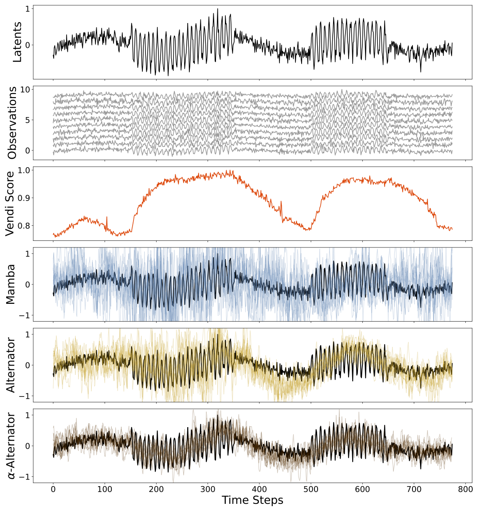

# Alpha Alternator [](https://www.arxiv.org/abs/2502.04593)


## Introduction
The **Alpha Alternator** is a novel generative model designed for time-dependent data, dynamically adapting to varying noise levels in sequences. Unlike state-of-the-art dynamical models such as Mamba, which assume uniform noise across sequences, the Alpha Alternator leverages the **Vendi Score (VS)** to adaptively adjust the influence of sequence elements on predicted future dynamics at each time step.



## Key Features
- **Adaptive Noise Handling**: Dynamically balances reliance on input sequences and latent history based on learned parameters.
- **Vendi Score (VS) Integration**: Uses a similarity-based diversity metric to assess sequence informativeness.
- **Alternator Loss Optimization**: Enhances robustness through observation masking and targeted loss minimization.
- **Superior Performance**: Outperforms state-space models and Alternators in **trajectory prediction, imputation, and forecasting**.

## Methodology
The Alpha Alternator dynamically adjusts its prediction strategy based on a learned parameter.

Training involves **observation masking** to simulate diverse noise levels and **Alternator loss minimization** to improve model resilience.

## Installation
To set up the environment, install the required dependencies:
```bash
pip install -r requirements.txt
```

### Monash and Neural Datasets
The datasets used in this research can be downloaded from:
- [Monash Datasets](https://github.com/wzhwzhwzh0921/S-D-Mamba/releases/download/datasets/S-Mamba_datasets.zip)
- [Full Dataset (Motor Cortex, Somatosensory Cortex, Hippocampus)](https://www.dropbox.com/sh/n4924ipcfjqc0t6/AACPWjxDKPEzQiXKUUFriFkJa?dl=0)

These datasets are available in both MATLAB and Python formats.

## Results
Experimental results demonstrate that the Alpha Alternator achieves **state-of-the-art performance** in **neural decoding and time-series forecasting**, surpassing existing Alternators and state-space models.

## Citation
If you use the Alpha Alternator model in your research, please cite:
```bibtex
@article{rezaei2025alpha,
  title={The Alpha Alternator: Dynamic Adaptation to Varying Noise Levels in Sequences Using the Vendi Score for Improved Robustness and Performance},
  author={Rezaei, Mohammad R. and Dieng, Adji Bousso},
  journal={arXiv preprint arXiv:2502.04593},
  year={2025}
}
```

## License
This project is licensed under the MIT License. See the LICENSE file for details.

